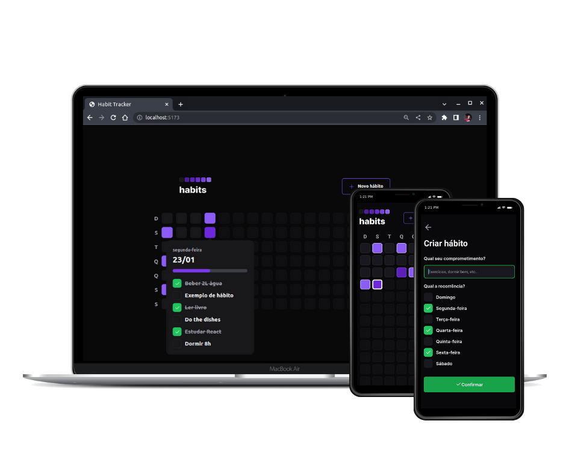

<h1 align="center">
  

</h1>

<p align="center">
  <a href="#-tecnologias">Tecnologias</a>&nbsp;&nbsp;&nbsp;|&nbsp;&nbsp;&nbsp;
  <a href="#-projeto">Projeto</a>&nbsp;&nbsp;&nbsp;|&nbsp;&nbsp;&nbsp;
  <a href="#-layout">Layout</a>&nbsp;&nbsp;&nbsp;|&nbsp;&nbsp;&nbsp;
  <a href="#-como-executar">Como executar</a>&nbsp;&nbsp;&nbsp;|&nbsp;&nbsp;&nbsp;
  <a href="#-future-tasks">Future Tasks</a>&nbsp;&nbsp;&nbsp;|&nbsp;&nbsp;&nbsp;
  <a href="#-licença">Licença</a>
</p>

<br>

<p align="center">
  
</p>

## ✨ Tecnologias

Esse projeto foi desenvolvido com as seguintes tecnologias:

### Front-end:
- [React.js](https://reactjs.org/)
- [Vite](https://vitejs.dev/)
- [Typescript](https://www.typescriptlang.org/)
- [Tailwind CSS](https://tailwindcss.com/)

### Back-end:
- [Node.js](https://nodejs.org/en/)
- [Fastify](https://www.fastify.io/)
- [Prisma](https://www.prisma.io/)

### Mobile
- [React Native](https://reactnative.dev/)
- [Expo](https://expo.dev/)
- [NativeWind](https://www.nativewind.dev/)


## 💻 Projeto

Este projeto foi desenvolvido durante o evento **NLW Setup**, tendo como objetivo o rastreamento da execução de hábitos diários.

Com o layout similar ao quadro de contribuições diárias do Github, o _Habit Tracker_ possui um quadro em que é possível fazer o cadastro de novos hábitos, selecionar o dia do mês e apontar quais hábitos foram feitos no dia, fazendo com que a cor seja alterada indicando menos ou mais hábitos praticados naquele dia.

## 🔖 Layout

Você pode visualizar o layout do projeto, tanto a versão web quanto a versão mobile, através [desse link](https://www.figma.com/file/sadVZl0IZ3Kyb2q8S5fQpk/Habits-(i)-(Community)?node-id=6%3A344&t=MyouBDVgEXni6KqA-0). É necessário ter conta no [Figma](https://figma.com) para acessá-lo.

## 🚀 Como Executar

<!--
* 🌐 **Conectando-se à aplicação online**
    * Para acessar ao projeto em execução no ambiente da Vercel, acesse um dos seguintes links:

        [Link 1]() / [Link 2]() / [Link 3]()

<br>
-->

* 🧑‍💻 **Conectando-se à aplicação localmente**
    * No [Github](https://github.com/AndreNavarro/Habit-Tracker), faça um clone deste projeto em sua máquina com o seguinte comando:
        ```
        git clone https://github.com/AndreNavarro/Habit-Tracker.git
        ```
    * Verá que há três pastas, uma referente à aplicação web, uma à mobile e uma referente à api back-end, que é utilizada tanto para web quanto mobile.
    * Faça uma cópia do arquivo .env (pasta server) e renomeie removendo a descrição ".sample". É necessário que sejam preenchidos os dados corretamente dentro deste arquivo.

  * 🖥️ **Aplicação web**  
    * Execute ```npm run dev``` tanto no diretório da api back-end quanto no projeto front-end para iniciar a aplicação.

    <br/>    

  * 📱 **Aplicação mobile**
    * Execute ```npm run dev``` no diretório da api back-end.
    * Execute ```npx expo start``` e com seu emulador ou smartphone com app do Expo instalado, acesse via QR Code a aplicação.

## 🔮 Future Tasks

- [ ] Autenticação (Firebase, Auth0 ou Social)
- [ ] Notificação Push / Service Workers / Lembretes
- [ ] Perfil público com gráfico de resumo

## 📝 Licença

Projeto apresentado pela Rocketseat durante a **Next Level Week - Setup** (nlw #11).